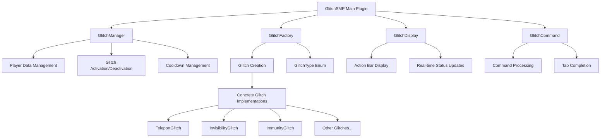
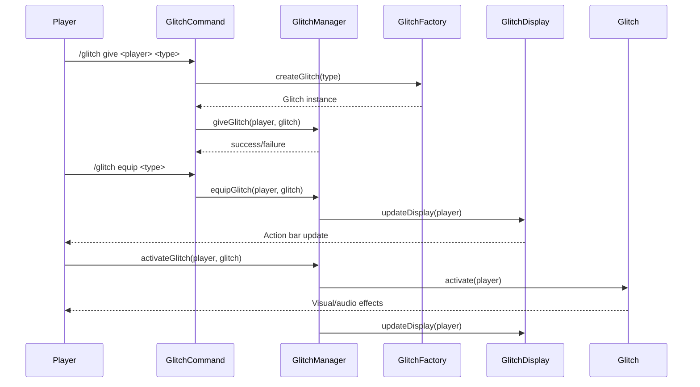
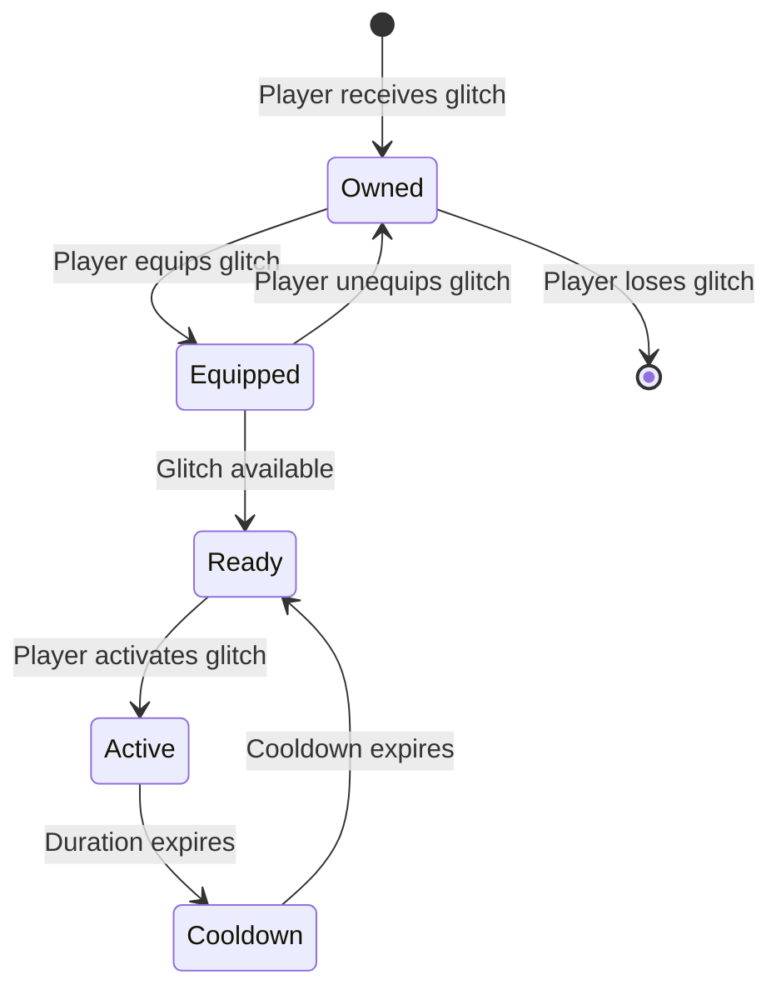

# GlitchSMP Plugin

A revolutionary Minecraft Bukkit/Spigot plugin that transforms vanilla SMP gameplay into an intense PvP experience through the power of "glitches" - special abilities that players can equip and activate to gain tactical advantages.

## 🎮 Overview

GlitchSMP introduces a unique glitch system where players can equip up to two glitches simultaneously, each providing distinct abilities that range from teleportation and invisibility to inventory manipulation and damage immunity. This transforms the traditional SMP experience into a dynamic PvP environment where strategy and glitch combinations determine victory.

## 🏗️ Architecture

### Core Components



### Data Flow



## 🎯 Glitch System

### Glitch Categories

The plugin features **17 unique glitches** divided into several categories:

#### 🚀 **Movement & Mobility**
- **Teleport Glitch**: Instant teleportation to target location (20 block range)
- **Glide Glitch**: Launch into sky for aerial escape
- **Invisibility Glitch**: Complete invisibility for 30 seconds

#### 🛡️ **Defensive & Protection**
- **Immunity Glitch**: Complete damage immunity for 30 seconds
- **Freeze Glitch**: Immobilize opponents for 30 seconds
- **Dream Glitch**: Disguise as Dream with enhanced loot drops

#### ⚔️ **Combat & Offensive**
- **Crash Glitch**: Disconnect opponents for 15 seconds
- **Herobrine Glitch**: Lightning strikes on damage + Speed II
- **Effect Glitch**: Amplify potion effects (Strength I → Strength II)

#### 🎒 **Inventory & Items**
- **Dupe Glitch**: Duplicate items in hand
- **Inventory Glitch**: Scramble inventory layout
- **Item Glitch**: Disable weapons for 30 seconds
- **Fake Block Glitch**: Create walkable fake blocks

#### 🌍 **World & Environment**
- **Redstone Glitch**: Disable all redstone for 30 seconds
- **Virus Glitch**: Screen overlay affecting 6-block radius
- **Diffuser Glitch**: Disable all glitches for 30 seconds

#### 🎭 **Miscellaneous**
- **Morph Glitch**: Transform into other players

### Glitch Mechanics



## 🎮 Usage

### Commands

| Command | Permission | Description |
|---------|------------|-------------|
| `/glitch give <player> <type>` | `glitchsmp.command.glitch.give` | Give a glitch to a player |
| `/glitch equip <type>` | `glitchsmp.command.glitch.equip` | Equip a glitch |
| `/glitch unequip <type>` | `glitchsmp.command.glitch.unequip` | Unequip a glitch |
| `/glitch list` | `glitchsmp.command.glitch.list` | List available glitches |
| `/glitch help` | `glitchsmp.command.glitch` | Show help message |

### Permissions

```yaml
glitchsmp.command.glitch: true          # Basic command access
glitchsmp.command.glitch.give: op       # Give glitches to players
glitchsmp.command.glitch.list: true     # List available glitches
glitchsmp.command.glitch.equip: true    # Equip glitches
glitchsmp.command.glitch.unequip: true  # Unequip glitches
```

### Player Experience

1. **Obtain Glitches**: Admins give glitches using `/glitch give`
2. **Equip Glitches**: Players equip up to 2 glitches using `/glitch equip`
3. **Monitor Status**: Real-time display shows equipped glitches above hotbar
4. **Activate Glitches**: Use glitch abilities during gameplay
5. **Manage Cooldowns**: Wait for cooldowns to expire before reusing

## 🔧 Technical Implementation

### Core Classes

#### `GlitchSMP.java` - Main Plugin Class
- **Purpose**: Plugin lifecycle management and component coordination
- **Responsibilities**: 
  - Initialize managers and factories
  - Handle player join/quit events
  - Coordinate between components

#### `GlitchManager.java` - Data Management
- **Purpose**: Centralized glitch state management
- **Key Features**:
  - Player glitch ownership tracking
  - Equipped glitch management (max 2 per player)
  - Activation/deactivation coordination
  - Cooldown and duration tracking

#### `Glitch.java` - Abstract Base Class
- **Purpose**: Common glitch functionality
- **Features**:
  - Cooldown and duration management
  - Activation state tracking
  - Abstract activation/deactivation methods

#### `GlitchDisplay.java` - UI Management
- **Purpose**: Real-time status display
- **Features**:
  - Action bar updates every 0.5 seconds
  - Color-coded status indicators
  - Duration and cooldown timers

### Glitch Implementation Pattern

```java
public class ExampleGlitch extends Glitch {
    private static final long DURATION_MILLIS = 30 * 1000; // 30 seconds
    private static final long COOLDOWN_MILLIS = 5 * 60 * 1000; // 5 minutes
    
    public ExampleGlitch() {
        super(
            GlitchType.EXAMPLE.getName(),
            GlitchType.EXAMPLE.getDescription(),
            COOLDOWN_MILLIS,
            DURATION_MILLIS
        );
    }
    
    @Override
    protected void onActivate(Player player) {
        // Implement glitch effect
        player.sendMessage("§aGlitch activated!");
    }
    
    @Override
    protected void onDeactivate(Player player) {
        // Clean up glitch effect
        player.sendMessage("§cGlitch deactivated!");
    }
}
```

## 🎨 Visual Indicators

### Action Bar Display

The plugin provides real-time status updates through the action bar:

- **🟢 Green**: Active glitch with remaining duration
- **🔴 Red**: Glitch on cooldown with remaining time
- **🟡 Yellow**: Ready glitch available for activation

Example: `Invisibility Glitch (15s) | Teleport Glitch (5s)`

### Glitch Effects

Each glitch includes:
- **Visual Effects**: Particles, glowing, screen overlays
- **Audio Effects**: Custom sounds for activation/deactivation
- **Feedback Messages**: Clear status notifications

## 🚀 Installation

### Requirements
- **Minecraft Server**: 1.21+ (Paper/Spigot recommended)
- **Java**: 17 or higher
- **Permissions**: Basic Bukkit permissions

### Setup
1. Download the latest `GlitchSMP.jar`
2. Place in your server's `plugins/` directory
3. Restart your server
4. Configure permissions as needed
5. Use `/glitch give` to distribute glitches to players

## 🔄 Development

### Building from Source

```bash
# Clone the repository
git clone https://github.com/nu11ified/GlitchSMP.git
cd GlitchSMP

# Build with Gradle
./gradlew build

# Find the JAR in build/libs/
```

### Adding New Glitches

1. **Create Implementation**: Extend `Glitch` class
2. **Add to Enum**: Update `GlitchType.java`
3. **Register in Factory**: Add to `GlitchFactory.createGlitch()`
4. **Test**: Verify activation/deactivation works correctly

### Project Structure

```
src/main/java/org/nu11ified/glitchSMP/
├── GlitchSMP.java              # Main plugin class
├── command/
│   └── GlitchCommand.java      # Command handling
├── display/
│   └── GlitchDisplay.java      # UI management
├── glitch/
│   ├── Glitch.java            # Abstract base class
│   ├── GlitchFactory.java     # Glitch creation
│   ├── GlitchType.java        # Glitch definitions
│   └── impl/                  # Concrete implementations
│       ├── ImmunityGlitch.java
│       ├── InvisibilityGlitch.java
│       └── TeleportGlitch.java
└── manager/
    └── GlitchManager.java      # Data management
```

## 🎯 Gameplay Impact

### Strategic Depth
- **Glitch Combinations**: Players must choose complementary glitch pairs
- **Timing**: Proper activation timing is crucial for success
- **Resource Management**: Limited glitch slots create strategic decisions

### PvP Enhancement
- **Dynamic Combat**: Traditional PvP becomes unpredictable
- **Tactical Retreats**: Glitches enable creative escape mechanisms
- **Psychological Warfare**: Invisibility and morphing create mind games

### Balance Considerations
- **Cooldown System**: Prevents spam and maintains balance
- **Duration Limits**: Temporary effects prevent permanent advantages
- **Counterplay**: Each glitch has weaknesses and counters

## 🤝 Contributing

We welcome contributions! Please:

1. Fork the repository
2. Create a feature branch
3. Implement your changes
4. Add tests if applicable
5. Submit a pull request

### Code Style
- Follow Java naming conventions
- Add comprehensive JavaDoc comments
- Include error handling for edge cases
- Test thoroughly before submitting

## 📄 License

This project is licensed under the MIT License - see the LICENSE file for details.

## 🙏 Acknowledgments

- **Nu11ified**: Original plugin developer
- **Bukkit/Spigot Team**: For the excellent plugin API
- **Minecraft Community**: For inspiration and feedback

---

**Transform your SMP server into an intense PvP battleground with the power of glitches!** 🎮⚡ 