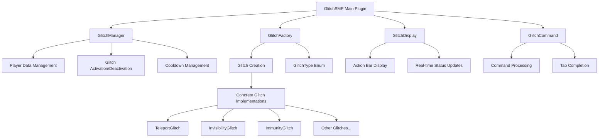
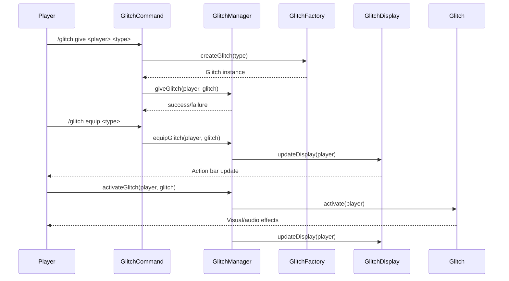
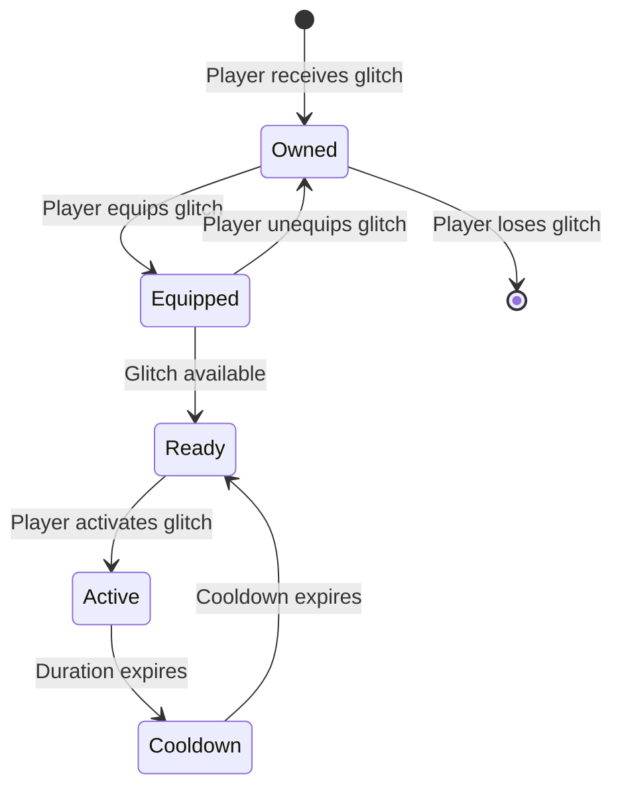

# GlitchSMP Plugin

A revolutionary Minecraft Bukkit/Spigot plugin that transforms vanilla SMP gameplay into an intense PvP experience through the power of "glitches" - special abilities that players can equip and activate to gain tactical advantages.

## 🎮 Overview

GlitchSMP introduces a unique glitch system where players can equip up to two glitches simultaneously, each providing distinct abilities that range from teleportation and invisibility to inventory manipulation and damage immunity. This transforms the traditional SMP experience into a dynamic PvP environment where strategy and glitch combinations determine victory.

## 🏗️ Architecture

### Core Components



### Data Flow



## 🎯 Glitch System

### Glitch Categories

The plugin features **17 unique glitches** divided into several categories:

#### 🚀 **Movement & Mobility**
- **Teleport Glitch**: Instant teleportation to target location (20 block range)
- **Glide Glitch**: Launch into sky for aerial escape
- **Invisibility Glitch**: Complete invisibility for 30 seconds

#### 🛡️ **Defensive & Protection**
- **Immunity Glitch**: Complete damage immunity for 30 seconds
- **Freeze Glitch**: Immobilize opponents for 30 seconds
- **Dream Glitch**: Disguise as Dream with enhanced loot drops

#### ⚔️ **Combat & Offensive**
- **Crash Glitch**: Disconnect opponents for 15 seconds
- **Herobrine Glitch**: Lightning strikes on damage + Speed II
- **Effect Glitch**: Amplify potion effects (Strength I → Strength II)

#### 🎒 **Inventory & Items**
- **Dupe Glitch**: Duplicate items in hand
- **Inventory Glitch**: Scramble inventory layout
- **Item Glitch**: Disable weapons for 30 seconds
- **Fake Block Glitch**: Create walkable fake blocks

#### 🌍 **World & Environment**
- **Redstone Glitch**: Disable all redstone for 30 seconds
- **Virus Glitch**: Screen overlay affecting 6-block radius
- **Diffuser Glitch**: Disable all glitches for 30 seconds

#### 🎭 **Miscellaneous**
- **Morph Glitch**: Transform into other players

### Glitch Mechanics



## 🎮 Usage

### Commands

| Command | Permission | Description |
|---------|------------|-------------|
| `/glitch give <player> <type>` | `glitchsmp.command.glitch.give` | Give a glitch to a player |
| `/glitch equip <type>` | `glitchsmp.command.glitch.equip` | Equip a glitch |
| `/glitch unequip <type>` | `glitchsmp.command.glitch.unequip` | Unequip a glitch |
| `/glitch list [all]` | `glitchsmp.command.glitch.list` | List available glitches |
| `/glitch help` | `glitchsmp.command.glitch` | Show help message |

#### Admin Commands

| Command | Permission | Description |
|---------|------------|-------------|
| `/glitch reset <player>` | `glitchsmp.command.glitch.reset` | Reset player's glitch crafting count |
| `/glitch status <player>` | `glitchsmp.command.glitch.status` | View player's glitch status |

### Permissions

```yaml
glitchsmp.command.glitch: true          # Basic command access
glitchsmp.command.glitch.give: op       # Give glitches to players
glitchsmp.command.glitch.list: true     # List available glitches
glitchsmp.command.glitch.equip: true    # Equip glitches
glitchsmp.command.glitch.unequip: true  # Unequip glitches
glitchsmp.command.glitch.reset: op      # Reset player glitch counts
glitchsmp.command.glitch.status: op     # View player glitch status
```

### Crafting System

Glitches can now be crafted using custom recipes! Server owners can customize these recipes in the `recipes.yml` file with a flexible item definition system:

```yaml
# ITEM DEFINITIONS:
# Define what each letter represents
items:
  E: minecraft:ender_pearl
  D: minecraft:diamond
  G: minecraft:glass

# RECIPES:
# Use letters in 3x3 grid patterns
TELEPORT:
  - "E E E"
  - "E E E" 
  - "E E E"
```

**Benefits of the new system:**
- **Easy to add new items**: Just add them to the `items` section
- **Flexible recipes**: Use any letter combination in 3x3 grids
- **Item agnostic**: Recipes don't need to specify materials directly
- **Easy customization**: Change materials without modifying recipe patterns

**How to use:**
1. **Obtain Glitch Items**: Craft glitches using the recipes in `recipes.yml`
2. **Right-click Glitch Items**: Right-click any glitch item to add it to your collection
3. **Equip Glitches**: Use `/glitch equip <glitch>` to equip up to 2 glitches
4. **Activate Glitches**: Use the intuitive activation system (see below)

### Intuitive Activation System

**Glitch Slots:**
- **Right Slot (Slot 0)**: Activated with offhand keybind (F key)
- **Left Slot (Slot 1)**: Activated with crouch + offhand keybind

**Activation Steps:**
1. **Equip Glitches**: Use `/glitch equip` to equip up to 2 glitches
2. **Select Slot**: 
   - Stand normally for right slot
   - Crouch for left slot
3. **Activate**: Press your offhand keybind (F key by default)
4. **Visual Feedback**: Action bar shows which slot is selected and activation status

**No more commands needed for activation!** Just use your offhand keybind naturally during gameplay.

### Glitch Activation in Detail

**Complete Activation Process:**
1. **Equip Glitches**: Use `/glitch equip <glitch>` to prepare glitches
2. **Select Slot**: Stand normally (right slot) or crouch (left slot)
3. **Activate**: Press F key (offhand keybind) to trigger selected glitch
4. **Feedback**: Action bar shows activation status and cooldowns

**Real Usage Examples:**
- **Teleport Glitch**: Look at target location, press F key, instant teleport
- **Invisibility Glitch**: Crouch + F key, 30 seconds of invisibility
- **Immunity Glitch**: Press F key, 30 seconds of damage immunity
- **Freeze Glitch**: Crouch + F key, freeze opponent for 30 seconds

**Strategic Usage Scenarios:**
- **PvP Combat**: Activate defensive glitches before engaging enemies
- **Escape Situations**: Use mobility glitches to reposition safely
- **Team Coordination**: Combine different glitch effects for coordinated attacks
- **Resource Gathering**: Use utility glitches to enhance efficiency

### Anti-Stockpiling System

**Glitch Limits:**
- **Maximum 2 glitches per player**: Prevents mass production
- **Death mechanics**: Players drop one random glitch when they die
- **Duplicate prevention**: Cannot pick up glitches you already own
- **Crafting enforcement**: Cannot craft more than 2 glitches

**Death & Recovery:**
1. **On Death**: One random glitch drops as an item at death location
2. **Item Pickup**: Other players can pick up dropped glitches (if they have empty slots)
3. **Crafting Reset**: Death reduces your crafting count, allowing you to craft again
4. **Balance**: Ensures glitches circulate between players instead of accumulating

### Player Experience

1. **Obtain Glitches**: Craft glitches using recipes OR admins give glitches using `/glitch give`
2. **Equip Glitches**: Players equip up to 2 glitches using `/glitch equip`
3. **Monitor Status**: Real-time display shows equipped glitches above hotbar with slot indicators
4. **Activate Glitches**: Use intuitive offhand keybind system during gameplay
5. **Manage Cooldowns**: Wait for cooldowns to expire before reusing

### Gameplay Examples

#### **PvP Combat Scenario:**
```
1. Player sees enemy approaching with diamond sword
2. Player crouches (selects left slot with Invisibility Glitch)
3. Player presses F key → Invisibility Glitch activates
4. Player becomes invisible for 30 seconds
5. Player can safely reposition or escape
6. After 30 seconds, invisibility ends
7. Must wait 5 minutes before using again
```

#### **Escape and Reposition:**
```
1. Player is trapped by multiple enemies
2. Player looks at safe location 20 blocks away
3. Player presses F key (right slot with Teleport Glitch)
4. Player instantly teleports to safety
5. Teleport Glitch goes on 30-second cooldown
6. Player can now plan next move
```

#### **Defensive Strategy:**
```
1. Player is low health in combat
2. Player presses F key (right slot with Immunity Glitch)
3. Player becomes immune to damage for 30 seconds
4. Player can safely retreat or counter-attack
5. Immunity Glitch goes on 2-minute cooldown
6. Player must be strategic about next engagement
```

#### **Team Coordination:**
```
1. Player 1: Uses Immunity Glitch → Becomes tank for team
2. Player 2: Uses Invisibility Glitch → Flanks enemies unseen
3. Player 3: Uses Teleport Glitch → Repositions for support
4. Coordinated attack with different glitch effects
5. Each player manages their own cooldowns
```

### Learning Curve and Mastery

#### **Beginner Level (First Time Users):**
- **"How do I use glitches?"**
  - Read action bar: "Offhand: Right, Crouch+Offhand: Left"
  - Try pressing F key → Success!
  - Understand basic slot system

#### **Intermediate Level (Getting Used To):**
- **"Which slot am I using?"**
  - Check action bar: [R] and [L] indicators
  - Stand normally = right slot, crouch = left slot
  - Plan which glitch to use in which slot

#### **Advanced Level (Strategic Usage):**
- **"Master glitch combinations"**
  - Know all cooldowns and durations
  - Plan glitch combinations for different scenarios
  - Use at perfect timing for maximum effect
  - Coordinate with teammates

#### **Expert Level (PvP Mastery):**
- **"Predict and counter"**
  - Anticipate enemy glitch usage
  - Save glitches for critical moments
  - Use glitches to create openings
  - Master the art of glitch timing

## 🔧 Technical Implementation

### Core Classes

#### `GlitchSMP.java` - Main Plugin Class
- **Purpose**: Plugin lifecycle management and component coordination
- **Responsibilities**: 
  - Initialize managers and factories
  - Handle player join/quit events
  - Coordinate between components

#### `GlitchManager.java` - Data Management
- **Purpose**: Centralized glitch state management
- **Key Features**:
  - Player glitch ownership tracking
  - Equipped glitch management (max 2 per player)
  - Activation/deactivation coordination
  - Cooldown and duration tracking

#### `Glitch.java` - Abstract Base Class
- **Purpose**: Common glitch functionality
- **Features**:
  - Cooldown and duration management
  - Activation state tracking
  - Abstract activation/deactivation methods

#### `GlitchDisplay.java` - UI Management
- **Purpose**: Real-time status display
- **Features**:
  - Action bar updates every 0.5 seconds
  - Color-coded status indicators with slot information
  - Duration and cooldown timers
  - Enhanced visual feedback with slot indicators

#### `RecipeManager.java` - Crafting System
- **Purpose**: Manages glitch crafting recipes
- **Features**:
  - Loads custom recipes from `recipes.yml`
  - Registers recipes with the server
  - Creates glitch items with custom lore
  - Server owner customization support

#### `ActivationManager.java` - Intuitive Activation
- **Purpose**: Handles glitch activation through player actions
- **Features**:
  - Offhand keybind detection for right slot
  - Crouch + offhand detection for left slot
  - Glitch item interaction handling
  - Player state tracking and cleanup

#### `CraftingLimiter.java` - Anti-Stockpiling System
- **Purpose**: Prevents glitch overproduction and manages death mechanics
- **Features**:
  - 2-glitch limit per player
  - Random glitch dropping on death
  - Duplicate glitch prevention
  - Crafting cooldown enforcement

### Glitch Implementation Pattern

```java
public class ExampleGlitch extends Glitch {
    private static final long DURATION_MILLIS = 30 * 1000; // 30 seconds
    private static final long COOLDOWN_MILLIS = 5 * 60 * 1000; // 5 minutes
    
    public ExampleGlitch() {
        super(
            GlitchType.EXAMPLE.getName(),
            GlitchType.EXAMPLE.getDescription(),
            COOLDOWN_MILLIS,
            DURATION_MILLIS
        );
    }
    
    @Override
    protected void onActivate(Player player) {
        // Implement glitch effect
        player.sendMessage("§aGlitch activated!");
    }
    
    @Override
    protected void onDeactivate(Player player) {
        // Clean up glitch effect
        player.sendMessage("§cGlitch deactivated!");
    }
}
```

## 🎨 Visual Indicators

### Action Bar Display

The plugin provides real-time status updates through the action bar with enhanced slot indicators:

- **🟢 Green**: Active glitch with remaining duration
- **🔴 Red**: Glitch on cooldown with remaining time  
- **🟡 Yellow**: Ready glitch available for activation with ✓ checkmark
- **🔵 Blue**: Slot indicators [R] for right slot, [L] for left slot
- **🟠 Gold**: "Glitches:" label and activation hints

**New Format Example:**
```
Glitches: [R] Invisibility Glitch ✓ | [L] Teleport Glitch (25s) | Offhand: Right, Crouch+Offhand: Left
```

**Status Examples:**
- **Ready**: [R] Teleport Glitch ✓ (green checkmark = ready to use)
- **Active**: [L] Invisibility Glitch (15s) (green with timer = currently active)
- **Cooldown**: [R] Teleport Glitch (45s) (red with timer = waiting for cooldown)

**Slot System:**
- **[R]**: Right slot - activated with offhand keybind (F key)
- **[L]**: Left slot - activated with crouch + offhand keybind

**Slot Selection Feedback:**
- **Standing normally**: Right slot [R] automatically selected
- **Crouching**: Left slot [L] automatically selected
- **Real-time updates**: Action bar changes instantly when switching slots

### Glitch Effects

Each glitch includes:
- **Visual Effects**: Particles, glowing, screen overlays
- **Audio Effects**: Custom sounds for activation/deactivation
- **Feedback Messages**: Clear status notifications

### Cooldown and Duration Management

#### **How Cooldowns Work:**
```
Glitch activated → Duration runs → Cooldown starts → Ready again
```

#### **Example Timeline:**
```
0:00 - Activate Teleport Glitch
0:00-0:30 - Teleport effect active (instant)
0:30-2:30 - Cooldown period (2 minutes)
2:30+ - Ready to use again
```

#### **Multiple Glitch Management:**
```
Player has 2 glitches equipped:
- Teleport Glitch: On cooldown (1:45 remaining)
- Invisibility Glitch: Ready ✓

Strategy: Use Invisibility while waiting for Teleport to recharge
```

#### **Cooldown Types:**
- **Short Cooldown (30s)**: Teleport, Freeze, Item Glitch
- **Medium Cooldown (2-5 min)**: Immunity, Invisibility, Effect Glitch
- **Long Cooldown (5+ min)**: Glide, Crash, Virus Glitch

### Why This System Works

#### **Advantages of Natural Activation:**
1. **Intuitive Controls**: Uses natural Minecraft controls (F key, crouch)
2. **Fast Activation**: No typing commands during combat
3. **Strategic Depth**: Requires planning and timing
4. **Balanced Gameplay**: Cooldowns prevent spam
5. **Clear Feedback**: Visual indicators show exactly what's happening

#### **Player Experience Benefits:**
- **"This feels natural!"** - No learning curve for controls
- **"I can use this in combat!"** - Fast activation without commands
- **"I need to plan my usage!"** - Strategic depth and timing
- **"The feedback is clear!"** - Always know what's happening

#### **Integration with Minecraft:**
- **Seamless**: Feels like part of vanilla Minecraft
- **Familiar**: Players already know F key and crouch
- **Responsive**: Instant activation and feedback
- **Accessible**: Works for all skill levels

## 🚀 Installation

### Requirements
- **Minecraft Server**: 1.21+ (Paper/Spigot recommended)
- **Java**: 17 or higher
- **Permissions**: Basic Bukkit permissions

### Setup
1. Download the latest `GlitchSMP.jar`
2. Place in your server's `plugins/` directory
3. Restart your server
4. Configure permissions as needed
5. Customize glitch recipes in `recipes.yml` (optional)
6. Use `/glitch give` to distribute glitches to players OR let them craft them

### Configuration

#### `recipes.yml`
The plugin automatically creates a `recipes.yml` file in the `plugins/GlitchSMP/` folder. You can customize this file to change glitch crafting recipes:

```yaml
# Example: Change Teleport Glitch recipe to use diamonds
TELEPORT:
  - "D D D"
  - "D D D" 
  - "D D D"
  ingredients:
    D: DIAMOND
```

**Recipe Format:**
- **Shape**: 3x3 grid pattern using single characters
- **Ingredients**: Map of characters to Minecraft material names
- **Customization**: Modify materials, change patterns, or add new recipes

**Available Materials:**
- Use any valid Minecraft material name (e.g., `DIAMOND`, `EMERALD`, `NETHERITE_INGOT`)
- Check the [Minecraft Wiki](https://minecraft.wiki/w/Material) for complete material list

## 🔄 Development

### Building from Source

```bash
# Clone the repository
git clone https://github.com/nu11ified/GlitchSMP.git
cd GlitchSMP

# Build with Gradle
./gradlew build

# Find the JAR in build/libs/
```

### Adding New Glitches

1. **Create Implementation**: Extend `Glitch` class
2. **Add to Enum**: Update `GlitchType.java`
3. **Register in Factory**: Add to `GlitchFactory.createGlitch()`
4. **Test**: Verify activation/deactivation works correctly

### Project Structure

```
src/main/java/org/nu11ified/glitchSMP/
├── GlitchSMP.java              # Main plugin class
├── command/
│   └── GlitchCommand.java      # Command handling
├── display/
│   └── GlitchDisplay.java      # UI management
├── glitch/
│   ├── Glitch.java            # Abstract base class
│   ├── GlitchFactory.java     # Glitch creation
│   ├── GlitchType.java        # Glitch definitions
│   └── impl/                  # Concrete implementations
│       ├── ImmunityGlitch.java
│       ├── InvisibilityGlitch.java
│       └── TeleportGlitch.java
└── manager/
    ├── GlitchManager.java      # Data management
    ├── RecipeManager.java      # Crafting system
    ├── ActivationManager.java  # Intuitive activation
    └── CraftingLimiter.java    # Anti-stockpiling system
```

### Configuration Files

```
src/main/resources/
├── plugin.yml                  # Plugin metadata and commands
└── recipes.yml                 # Custom glitch crafting recipes
```

## 🎯 Gameplay Impact

### Strategic Depth
- **Glitch Combinations**: Players must choose complementary glitch pairs
- **Timing**: Proper activation timing is crucial for success
- **Resource Management**: Limited glitch slots create strategic decisions

### New Features in v2.0

#### 🛠️ **Crafting System**
- **Custom Recipes**: Server owners can define unique crafting recipes for each glitch
- **Glitch Items**: Physical items that players can craft and collect
- **Right-click to Obtain**: Simple interaction system for getting glitches
- **Configurable**: Easy to modify recipes in `recipes.yml`

#### 🎮 **Intuitive Activation**
- **Offhand Keybind**: Natural F key usage for right slot activation
- **Crouch + Offhand**: Left slot activation with crouch detection
- **No Commands**: Seamless integration with normal gameplay
- **Visual Feedback**: Clear slot selection and activation status

#### 🎨 **Enhanced UI**
- **Slot Indicators**: [R] and [L] markers for clear slot identification
- **Status Symbols**: ✓ checkmarks for ready glitches
- **Activation Hints**: Built-in help text in the action bar
- **Real-time Updates**: Instant feedback on all glitch states

#### 🛡️ **Anti-Stockpiling Protection**
- **2-Glitch Limit**: Prevents players from accumulating hundreds of glitches
- **Death Mechanics**: Random glitch dropping on death for item circulation
- **Duplicate Prevention**: Cannot pick up glitches you already own
- **Crafting Enforcement**: Automatic limit enforcement during crafting

#### 🔧 **Flexible Crafting System**
- **Item Definitions**: Centralized item mapping in `items` section
- **Recipe Patterns**: Clean 3x3 grid patterns using letters
- **Easy Customization**: Add new items without changing recipe structure
- **Material Agnostic**: Recipes work with any valid Minecraft materials

### PvP Enhancement
- **Dynamic Combat**: Traditional PvP becomes unpredictable
- **Tactical Retreats**: Glitches enable creative escape mechanisms
- **Psychological Warfare**: Invisibility and morphing create mind games

### Balance Considerations
- **Cooldown System**: Prevents spam and maintains balance
- **Duration Limits**: Temporary effects prevent permanent advantages
- **Counterplay**: Each glitch has weaknesses and counters

## 🔧 Troubleshooting

### Common Issues

**Glitches not activating:**
- Ensure you have glitches equipped using `/glitch equip`
- Check that you're using the correct keybind (F key by default)
- Verify you're not on cooldown (check action bar for red text)

**Crafting recipes not working:**
- Restart the server after modifying `recipes.yml`
- Check that material names are valid (e.g., `DIAMOND`, not `diamond`)
- Ensure recipe format follows the 3x3 grid pattern

**Action bar not showing:**
- Check if you have glitches equipped
- Verify the plugin is enabled (`/plugins` command)
- Restart the server if issues persist

**Permission errors:**
- Ensure you have the correct permissions for commands
- Check `plugin.yml` for permission requirements
- Use `/glitch help` to see available commands

### Getting Help

If you encounter issues:
1. Check the server console for error messages
2. Verify your Minecraft version (1.21+ required)
3. Ensure you're using Paper/Spigot, not vanilla
4. Check the [GitHub Issues](https://github.com/nu11ified/GlitchSMP/issues) page

## 🤝 Contributing

1. Fork the repository
2. Create a feature branch
3. Implement your changes
4. Add tests if applicable
5. Submit a pull request

### Code Style
- Follow Java naming conventions
- Add comprehensive JavaDoc comments
- Include error handling for edge cases
- Test thoroughly before submitting

## 📄 License

This project is licensed under the MIT License - see the LICENSE file for details.

## 🙏 Acknowledgments

- **Nu11ified**: Original plugin developer
- **Bukkit/Spigot Team**: For the excellent plugin API
- **Minecraft Community**: For inspiration and feedback

---

**Transform your SMP server into an intense PvP battleground with the power of glitches!** 🎮⚡ 